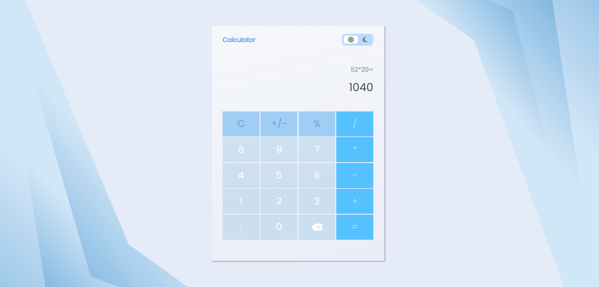
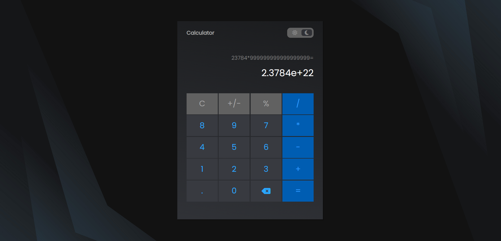

# Calculator App

A simple calculator web application with both light and dark themes. This calculator app is built using Object-Oriented Programming (OOP) principles to organize the code and separate concerns effectively.

## Features

- Basic arithmetic operations: addition, subtraction, multiplication, and division.
- Backspace functionality to correct input.
- Percentage calculation.
- Keyboard input support for convenient calculations.
- Theme toggle between light and dark themes.

## Tech Stack

- JavaScript
- HTML/CSS
- Font awesome

## Access the App

You can access the application at the following link: [Calculator App](https://nataly-horbunova.github.io/calculator/)

## Screenshots

### Light Theme

### Dark Theme

